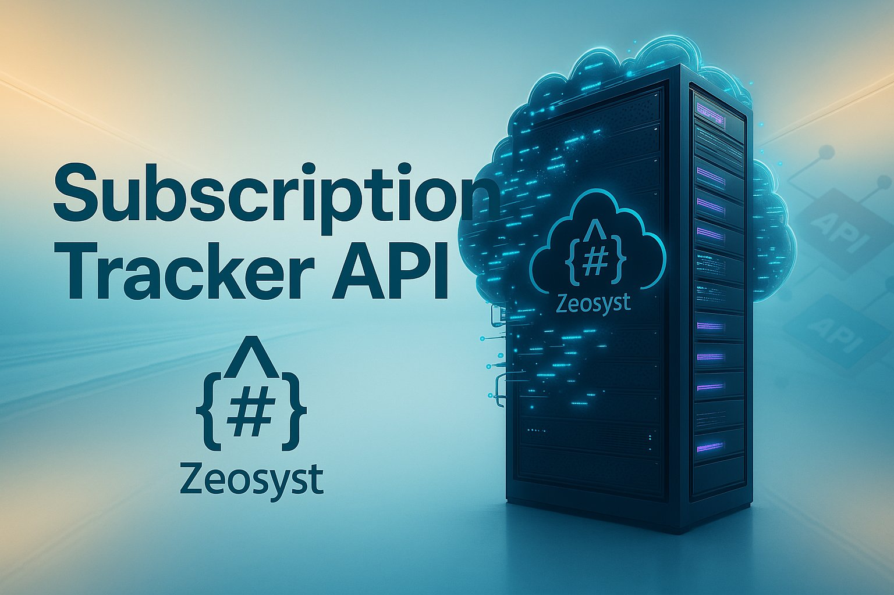

<div align="center">
   <div>
    
    
    
  </div>

  <h3 align="center">A Subscription Management System API</h3>

   <div align="center">
     Build this project following the step by step guide
    </div>
</div>

## 📋 <a name="table">Table of Contents</a>

1. 🤖 [Introduction](#introduction)
2. ⚙️ [Tech Stack](#tech-stack)
3. 🔋 [Features](#features)
4. 🤸 [Quick Start](#quick-start)
5. 🔗 [Assets](#links)

## <a name="introduction">🤖 Introduction</a>

This is a **production-ready Subscription Management System API** that handles **real users, real money, and real business logic**.  

Authenticate users using JWTs, connect a database, create models and schemas, and integrate it with ORMs. Structure the architecture of your API to ensure scalability and seamless communication with the frontend.  

## <a name="tech-stack">⚙️ Tech Stack</a>

- Node.js
- Express.js
- MongoDB

## <a name="features">🔋 Features</a>

👉 **Advanced Rate Limiting and Bot Protection**: with Arcjet that helps you secure the whole app.

👉 **Database Modeling**: Models and relationships using MongoDB & Mongoose.

👉 **JWT Authentication**: User CRUD operations and subscription management.

👉 **Global Error Handling**: Input validation and middleware integration.

👉 **Logging Mechanisms**: For better debugging and monitoring.

👉 **Email Reminders**: Automating smart email reminders with workflows using Upstash.

and many more, including code architecture and reusability

## <a name="quick-start">🤸 Quick Start</a>

Follow these steps to set up the project locally on your machine.

**Prerequisites**

Install the following on your machine:

- [Git](https://git-scm.com/)
- [Node.js](https://nodejs.org/en)
- [npm](https://www.npmjs.com/) (Node Package Manager)

**Cloning the Repository**

```bash
git clone https://github.com/DerrickZeo/tracker-api-subscription.git
cd tracker-api-subscription
```

**Installation**

Install the project dependencies using npm:

```bash
npm install
```

**Set Up Environment Variables**

Create a new file named `.env.local` in the root of your project and add the following content:

```env
# PORT
PORT=5500
SERVER_URL="http://localhost:5500"

# ENVIRONMENT
NODE_ENV=development

# DATABASE
DB_URI=

# JWT AUTH
JWT_SECRET=
JWT_EXPIRES_IN="1d"

# ARCJET
ARCJET_KEY=
ARCJET_ENV="development"

# UPSTASH
QSTASH_URL=http://127.0.0.1:8080
QSTASH_TOKEN=

# NODEMAILER
EMAIL_PASSWORD=
```

**Running the Project**

```bash
npm run dev
```

Open [http://localhost:5500](http://localhost:5500) in your browser or any HTTP client to test the project.

## <a name="snippets">🕸️ Snippets</a>

<details>
<summary><code>Sample JSON Data</code></summary>

```json
{
  "name": "Netflix",
  "price":19.00,
  "currency": "EUR",
  "frequency": "monthly",
  "category": "Entertainment",
  "startDate": "2025-04-04T00:00:00.000Z",
  "paymentMethod": "Credit Card"
}
```

</details>

## <a name="links">🔗 Links</a>

- **Arcjet** - [https://launch.arcjet.com/4g2R2e4](https://launch.arcjet.com/4g2R2e4)  
- **Upstash** - [https://bit.ly/42ealiN](https://bit.ly/42ealiN)    


